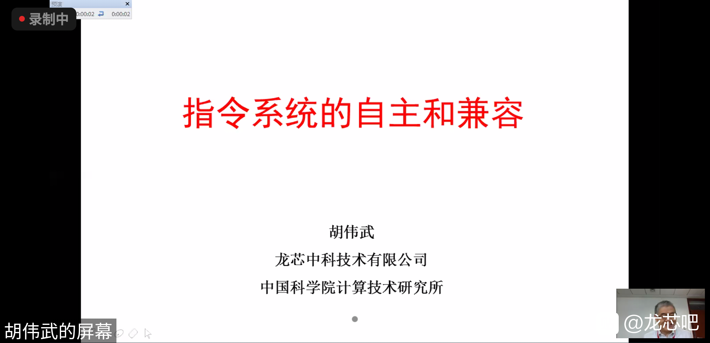
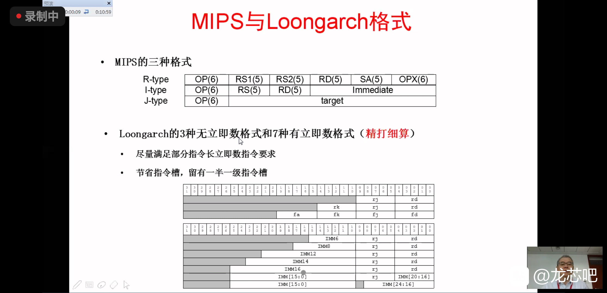
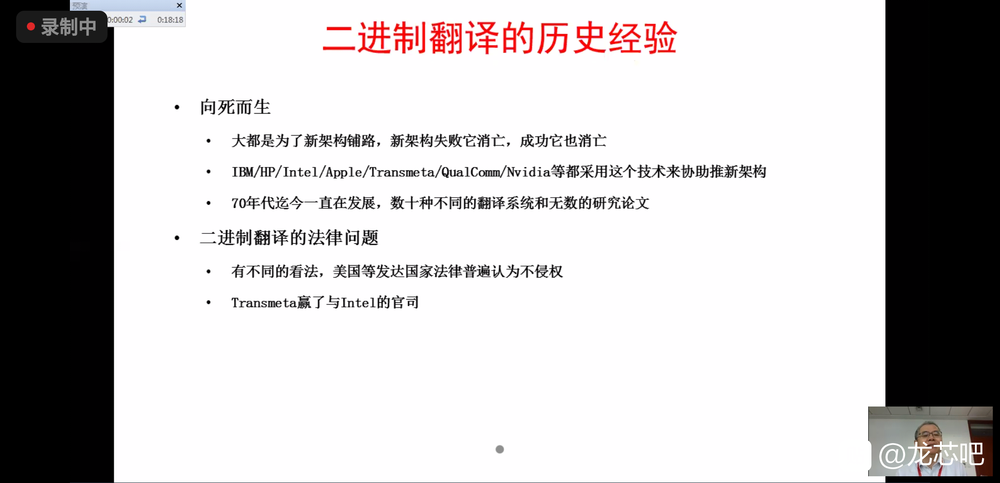
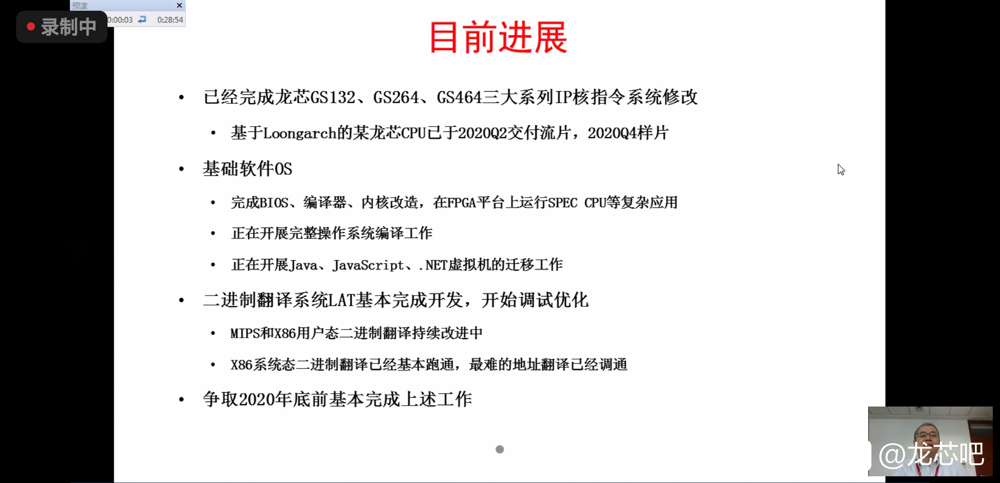

+++
title = "指令系统的自主与兼容"
description = ""
date = 2020-08-20T23:35:23+08:00
draft = false
comment = true
toc = true
reward = true
categories = [
  ""
]
tags = [
  "新闻"
]
+++

2020年8月13日上午10:30分，CCF全国计算机体系结构学术年会（ACA，Advanced Computer Architecture）上， 胡伟武研究员作了《指令系统的自主与兼容》报告。

<!--more-->



## 报告主要内容展示

