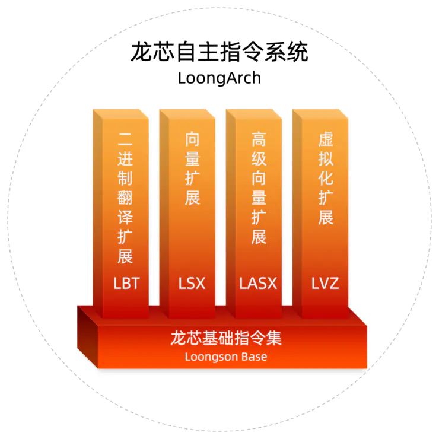
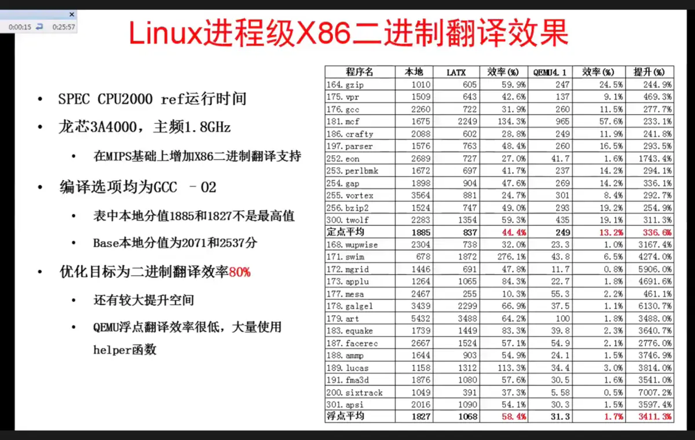
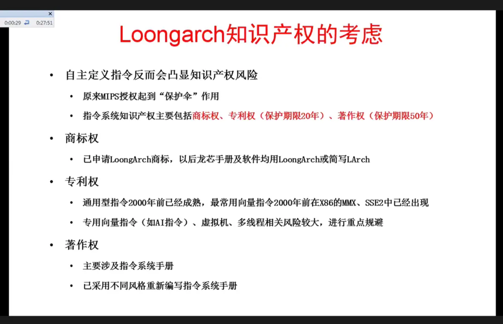
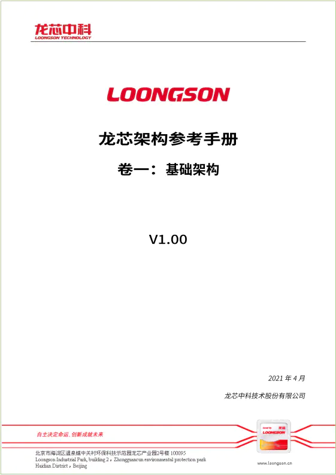

+++
title = "LoongArch指令集手册发布"
description = "LoongArch指令集手册发布"
date = 2021-05-01T09:00:00+08:00
draft = false
comment = true
toc = false
reward = false
categories = [
  ""
]
tags = [
  "新闻"
]
+++

2021年4月15日，龙芯小范围发布了指令集手册，以收集反馈意见。4月30日，龙芯正式发布了龙芯架构指令集手册V1.00。

<!--more-->

龙芯胡伟武在2020年8月参加CCF全国计算机体系结构学术年会时，曾披露龙芯将放弃MIPS架构，转向完全自主知识产权的LoongArch指令集，并做了[《指令系统的自主与兼容》特邀报告](https://www.bilibili.com/video/BV1BK411T7Za) 来介绍这一全新架构的设计思路。

该设计增加了支持生产级应用的向量指令集，并且能够以二进制翻译的方式兼容MIPS/RISC-V/ARM/x86这几种指令集的Linux程序，并且翻译MIPS指令集时损耗非常小。

核心态方面：硬件能够支持两级地址翻译，x86→LoongArch，虚地址→物理地址（通过改造内存快表TLB，做到两级虚地址映射以减少映射开销，以及减少指令使用/指令翻译开销，即X86虚地址直接翻译成龙芯物理地址），面积和延迟开销都不大；以及，地址空间、中断处理等方面支持OS跨主板和对升级后的CPU兼容；

用户态方面：功能上针对MIPS、X86、ARM、RISC-V的特征，绝大多数指令可以做到1对1或1对2翻译；还包括对X86的EFLAGS支持、RISC-V的原子同步指令支持；以及，ABI方面支持X86/MIPS系统调用兼容，支持MIPS汇编码直接翻译成LoongArch二进制。

为了完成这样的设计，龙芯架构定义了2500多条指令，但还预留了一半的一级指令槽，未来可以继续扩展。

胡伟武在演讲中介绍，在翻译运行X86应用时，开源的QEMU仅能达到5%的性能，而龙芯架构现在超过60%，优化后的目标是80%；翻译安卓ARM应用时，可以流畅运行移动版WPS和美图秀秀等。

龙芯此前使用的是MIPS指令集的授权，该授权允许龙芯自己修改，但不允许转授权，甚至不允许公布指令集手册，否则就将侵权。尽管龙芯已经是MIPS生态中性能最好的，但却仍然受制于人，不能自主引领生态。龙芯曾于2015年发布LoongISA指令集架构，该架构包括MIPS64 Release 2全套指令集和MIPS64 Release 5中的部分指令模块，以及其他一系列龙芯中科自主扩展的指令集。但由于从未公布过指令集手册，导致开发者实际上很难使用这些扩展指令集，这也是龙芯历年来在一系列性能测试中，官方发布的成绩总是不能由外界复现的原因。

2021年4月，拥有MIPS指令集的Wave Computing公司投向RISC-V阵营。龙芯也终于开始正式脱离MIPS生态。此次发布的LoongArch指令集是完全自主知识产权的。为此，龙芯公司还委托国内第三方知名知识产权评估机构对龙芯基础架构进行深入细致的知识产权评估。从2020年二季度开始，双方投入上百人月，将LoongArch与ALPHA、ARM、MIPS、POWER、RISC-V、X86等国际上主要指令系统有关资料和几万件专利进行深入对比分析。2021年1月，针对被评估的基础架构版本，该评估机构认为：LoongArch在指令系统设计、指令格式、指令编码、寻址模式等方面进行了自主设计。LoongArch指令系统手册在章节结构、指令说明结构和指令内容表达方面与上述国际上主要指令系统存在明显区别。LoongArch基础架构未发现对上述国际上主要指令系统中国专利的侵权风险。

2021年4月15日，龙芯小范围发布了指令集手册，以收集反馈意见。4月30日，龙芯正式发布了[龙芯架构指令集手册V1.00](http://www.loongson.cn/uploadfile/cpu/LoongArch.pdf)。

龙芯架构采用基础部分加扩展部分的模块化组织形式。一个兼容龙芯架构的CPU，除实现必需的基础部分外，可根据实际需求选择实现各扩展部分。此次对外发布的[《龙芯架构参考手册卷一：基础架构（V1.00）》](http://www.loongson.cn/uploadfile/cpu/LoongArch.pdf)主要介绍龙芯架构中的基础部分。

手册引言部分对龙芯架构进行了整体概述，介绍了指令编码格式、汇编助记格式等基本内容。手册的主体部分从非特权指令集和特权指令集两个方面对龙芯架构的基础部分展开描述，其中非特权指令集部分介绍了基础整数指令和基础浮点指令两类指令的应用程序编程模型、各指令的指令格式及其功能描述，特权指令集部分从特权资源整体架构、存储管理、例外与中断以及状态控制寄存器四个方面分别展开介绍。

此次与[《龙芯架构参考手册卷一：基础架构（V1.00）》](http://www.loongson.cn/uploadfile/cpu/LoongArch.pdf)同步发布的有[《龙芯架构32位精简版参考手册（V1.00）》](http://www.loongson.cn/uploadfile/cpu/LoongsonArch32.pdf) 。龙芯架构32位精简版是对龙芯架构32位基础部分的进一步简化，必选指令条数仅50余条，易于实现，将面向教学和科研领域开源推广。
