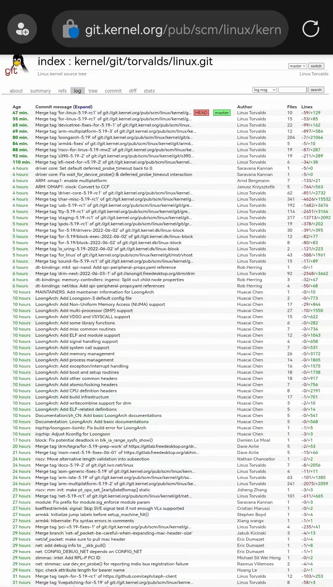

+++
title = "LoongArch 架构支持合并到 Linux 5.19 内核"
linktitle = "LoongArch 架构支持合并到 Linux 5.19 内核"
description = "LoongArch 架构支持合并到 Linux 5.19 内核"
date = 2022-06-04T17:32:00+08:00
draft = false
comment = true
toc = true
reward = false
categories = [
  "内核",
  "kernel",
]
tags = [
  "新闻"
]
+++

今天凌晨（当地时间6月3日晚），LoongArch CPU 的支持补丁被 Linus 合并进了主线内核，这意味着从 5.19 内核开始，用户空间 ABI 已经稳定。

<!--more-->

今天凌晨（当地时间6月3日晚），LoongArch CPU 的支持补丁被 Linus 合并进了主线内核，这意味着从 5.19 内核开始，用户空间 ABI 已经稳定。

国外相关新闻： https://www.phoronix.com/scan.php?page=news_item&px=LoongArch-Merged-Linux-5.19

到目前为止，工具链中的 binutils-2.38.50(开发版本)、gcc-12 已经进入上游，在内核此次合并代码之后，glibc 上游工作也可以顺利推进了，希望在 8 月份的 glibc-2.38 中能看到对 LoongArch 的支持。

本次内核合并的代码并不完整，EFI、PCI子系统、IRQ 驱动程序部分需要继续完善，预计在 5.20 版本内核将获得完整支持。

另外，基于最新(兼容)的上游代码，已经准备好了几种发行版，包括 CLFS、Gentoo、Archlinux，但需要您关注 [Firmware](https://github.com/loongson/Firmware) 项目，以获得新固件。

注：

1. 新固件采用物理地址内核，目前 **不能兼容现有 LoongArch 发行版**

2. 默认的 EFI 文件加载路径是 **<esp>/EFI/BOOT/BOOTLOONGARCH64.EFI**

社区发行版下载地址：

CLFS: https://github.com/loongson/build-tools/releases/tag/2022.05.29

Gentoo: https://mirrors.163.com/gentoo/experimental/loong/stages/20220528/

Archlinux: http://archlinux.oukan.online/2022.03/iso/
